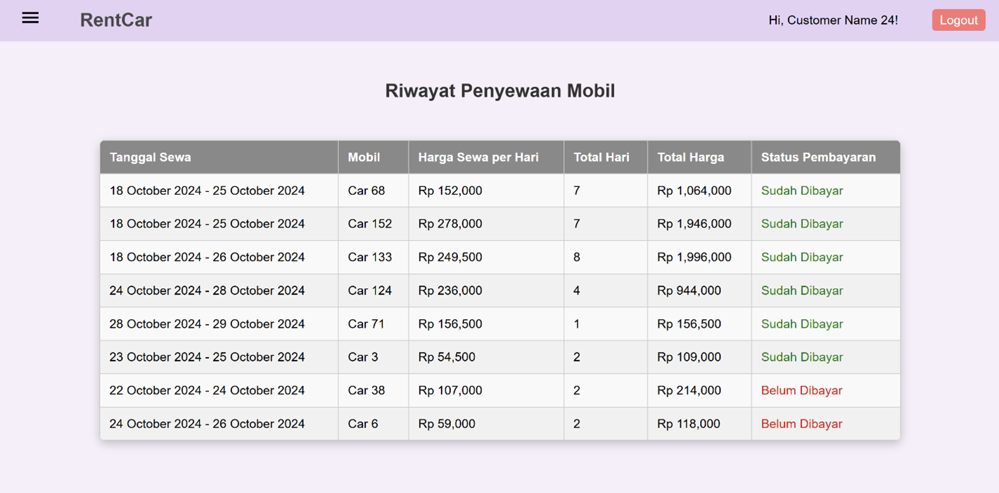

# ASP.NET Mini Project - Rental Car Website

 

**Name:** Ella Raputri

**Student ID:** 2702298154

 

## Project Description
RentCar is a website used for users to rent cars based on their desired date. The website contains several features to let user see the details of a car before booking them. It also stores user payment data, so that the user can see their rental history.

 

## Documentation
To access the full documentation (document and images) in detail, please refer to the 'Documentation' folder inside this repository.

 

## Features and Screenshots

&ensp;<b>Home Page</b>

- Home Page is the first page that the user accesses when opening this app.

- From here, the user can choose to Register or Login or navigate to other pages in the sidebar.

- After logging in, user can also search cars based on their desired date and car year. 

- Here are some images of this page:

   
   
   

&ensp;<b>Register and Login</b>

- The register and login are two separate pages.

- The register page is used to register user to the system, so that they can gain access to view cars and do payments in the website.

- Meanwhile, the login page is used to let the user login to their existing account. 

- Here are the image of these two pages:
   
   

&ensp;<b>Car Details</b>

- After user press the View Details button and they are already logged in, then they can view the information of the corresponding car.

- They can also click the "Sewa Sekarang" button to rent the car.

- Here are the image of this page:
  
 

&ensp;<b>Riwayat Penyewaan (Rental History)</b>

- Riwayat Penyewaan is a page that display the user rental history.

- Here, user can also pay for their unpaid rents by clicking the unpaid rent rows.

- Here are some images of this page:

   

   

&ensp;<b>Contact Us (Kontak Kami)</b>

- Kontak Kami is a page that contains the information of RentCar business, from location to website and contact number.

- There is also a FAQ section that contains the frequently asked questions by the user and the answers.

- Here are some images of this page:

   

  

 

